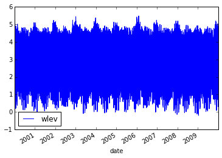
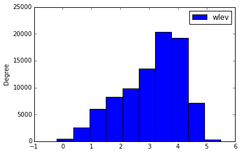
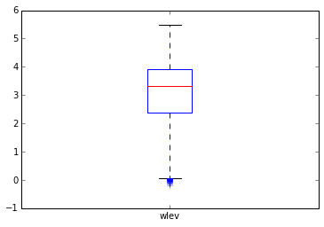

#Exploring tabular data with pandas

In this notebook, we will explore a time series of water levels at the Point Atkinson lighthouse using pandas. This is a basic introduction to pandas and we touch on the following topics:

* Reading a csv file
* Simple plots
* Indexing and subsetting
* DatetimeIndex
* Grouping
* Time series methods

 
##Getting started

You will need to have the python libraries pandas, numpy and matplotlib installed. These are all available through the Anaconda distribution of python.

* https://store.continuum.io/cshop/anaconda/

##Resources

There is a wealth of information in the pandas documentation.

* http://pandas.pydata.org/pandas-docs/stable/

Water level data (7795-01-JAN-2000_slev.csv) is from Fisheries and Oceans Canada and is available at this website:
* http://www.isdm-gdsi.gc.ca/isdm-gdsi/twl-mne/index-eng.htm

##Imports

To start, import pandas and a few other useful modules.

    import pandas as pd
    import matplotlib.pyplot as plt
    import datetime
    import numpy as np
    
    %matplotlib inline

##Read the data

It is helpful to understand the structure of your dataset before attempting to read it with pandas.

    !head 7795-01-JAN-2000_slev.csv

    Station_Name,Point Atkinson, B.C.
    Station_Number,7795
    Latitude_Decimal_Degrees,49.337
    Longitude_Decimal_Degrees,123.253
    Datum,CD
    Time_zone,UTC
    SLEV=Observed Water Level
    Obs_date,SLEV(metres)
    2000/01/01 08:00,2.95,
    2000/01/01 09:00,3.34,
    

This dataset contains comma separated values. It has a few rows of metadata (station name, longitude, latitude, etc).The actual data begins with timestamps and water level records at row 9. We can read this data with a pandas function read_csv().

read_csv() has many arguments to help customize the reading of many different csv files. For this file, we will
* skip the first 8 rows
* use index_col=False so that the first column is treated as data and not an index
* tell pandas to read the first column as dates (parse_dates=[0])
* name the columns as 'date' and 'wlev'.

We will use this information to customize how this data set is read by pandas.

    data = pd.read_csv('7795-01-JAN-2000_slev.csv', skiprows = 8,
                        index_col=False, parse_dates=[0], names=['date','wlev'])

data is a DataFrame object

    type(data)
    pandas.core.frame.DataFrame

Let's take a quick peak at the dataset.

    data.head()
    

<table border="1" class="dataframe">
  <thead>
    <tr style="text-align: right;">
      <th></th>
      <th>date</th>
      <th>wlev</th>
    </tr>
  </thead>
  <tbody>
    <tr>
      <th>0</th>
      <td>2000-01-01 08:00:00</td>
      <td>2.95</td>
    </tr>
    <tr>
      <th>1</th>
      <td>2000-01-01 09:00:00</td>
      <td>3.34</td>
    </tr>
    <tr>
      <th>2</th>
      <td>2000-01-01 10:00:00</td>
      <td>3.61</td>
    </tr>
    <tr>
      <th>3</th>
      <td>2000-01-01 11:00:00</td>
      <td>3.69</td>
    </tr>
    <tr>
      <th>4</th>
      <td>2000-01-01 12:00:00</td>
      <td>3.63</td>
    </tr>
  </tbody>
</table>

    data.tail()
    

<table border="1" class="dataframe">
  <thead>
    <tr style="text-align: right;">
      <th></th>
      <th>date</th>
      <th>wlev</th>
    </tr>
  </thead>
  <tbody>
    <tr>
      <th>87603</th>
      <td>2009-12-31 04:00:00</td>
      <td>1.41</td>
    </tr>
    <tr>
      <th>87604</th>
      <td>2009-12-31 05:00:00</td>
      <td>0.69</td>
    </tr>
    <tr>
      <th>87605</th>
      <td>2009-12-31 06:00:00</td>
      <td>0.30</td>
    </tr>
    <tr>
      <th>87606</th>
      <td>2009-12-31 07:00:00</td>
      <td>0.34</td>
    </tr>
    <tr>
      <th>87607</th>
      <td>2009-12-31 08:00:00</td>
      <td>0.83</td>
    </tr>
  </tbody>
</table>

    data.describe()
    

<table border="1" class="dataframe">
  <thead>
    <tr style="text-align: right;">
      <th></th>
      <th>wlev</th>
    </tr>
  </thead>
  <tbody>
    <tr>
      <th>count</th>
      <td>87608.000000</td>
    </tr>
    <tr>
      <th>mean</th>
      <td>3.093610</td>
    </tr>
    <tr>
      <th>std</th>
      <td>1.053402</td>
    </tr>
    <tr>
      <th>min</th>
      <td>-0.200000</td>
    </tr>
    <tr>
      <th>25%</th>
      <td>2.370000</td>
    </tr>
    <tr>
      <th>50%</th>
      <td>3.320000</td>
    </tr>
    <tr>
      <th>75%</th>
      <td>3.910000</td>
    </tr>
    <tr>
      <th>max</th>
      <td>5.490000</td>
    </tr>
  </tbody>
</table>

Notice that pandas did not apply the summary statistics to the date column.

##Simple Plots

pandas has support for some simple plotting features, like line plots, scatter plots, box plots, etc. For  full overview of plots visit http://pandas.pydata.org/pandas-docs/stable/visualization.html

Plotting is really easy. pandas even takes care of labels and legends.

    data.plot('date','wlev')

    data.plot(kind='hist')

    data.plot(kind='box')

##Indexing and Subsetting

We can index and subset the data in different ways.

###By row number

For example, grab the first two rows.

    data[0:2]
    

<table border="1" class="dataframe">
  <thead>
    <tr style="text-align: right;">
      <th></th>
      <th>date</th>
      <th>wlev</th>
    </tr>
  </thead>
  <tbody>
    <tr>
      <th>0</th>
      <td>2000-01-01 08:00:00</td>
      <td>2.95</td>
    </tr>
    <tr>
      <th>1</th>
      <td>2000-01-01 09:00:00</td>
      <td>3.34</td>
    </tr>
  </tbody>
</table>

Note that accessing a single row by the row number doesn't work!

    data[0]

    ---------------------------------------------------------------------------

    KeyError                                  Traceback (most recent call last)

    <ipython-input-13-88cae4a5bf31> in <module>()
    ----> 1 data[0]
    

    c:\Users\Nancy\Anaconda\lib\site-packages\pandas\core\frame.pyc in __getitem__(self, key)
       1795             return self._getitem_multilevel(key)
       1796         else:
    -> 1797             return self._getitem_column(key)
       1798 
       1799     def _getitem_column(self, key):
    

    c:\Users\Nancy\Anaconda\lib\site-packages\pandas\core\frame.pyc in _getitem_column(self, key)
       1802         # get column
       1803         if self.columns.is_unique:
    -> 1804             return self._get_item_cache(key)
       1805 
       1806         # duplicate columns & possible reduce dimensionaility
    

    c:\Users\Nancy\Anaconda\lib\site-packages\pandas\core\generic.pyc in _get_item_cache(self, item)
       1082         res = cache.get(item)
       1083         if res is None:
    -> 1084             values = self._data.get(item)
       1085             res = self._box_item_values(item, values)
       1086             cache[item] = res
    

    c:\Users\Nancy\Anaconda\lib\site-packages\pandas\core\internals.pyc in get(self, item, fastpath)
       2849 
       2850             if not isnull(item):
    -> 2851                 loc = self.items.get_loc(item)
       2852             else:
       2853                 indexer = np.arange(len(self.items))[isnull(self.items)]
    

    c:\Users\Nancy\Anaconda\lib\site-packages\pandas\core\index.pyc in get_loc(self, key, method)
       1570         """
       1571         if method is None:
    -> 1572             return self._engine.get_loc(_values_from_object(key))
       1573 
       1574         indexer = self.get_indexer([key], method=method)
    

    pandas\index.pyx in pandas.index.IndexEngine.get_loc (pandas\index.c:3824)()
    

    pandas\index.pyx in pandas.index.IndexEngine.get_loc (pandas\index.c:3704)()
    

    pandas\hashtable.pyx in pandas.hashtable.PyObjectHashTable.get_item (pandas\hashtable.c:12280)()
    

    pandas\hashtable.pyx in pandas.hashtable.PyObjectHashTable.get_item (pandas\hashtable.c:12231)()
    

    KeyError: 0

In that case, I would recommend using .iloc or slice for one row. 

    data.iloc[0]

    date    2000-01-01 08:00:00
    wlev                   2.95
    Name: 0, dtype: object

or

    data[0:1]

<table border="1" class="dataframe">
  <thead>
    <tr style="text-align: right;">
      <th></th>
      <th>date</th>
      <th>wlev</th>
    </tr>
  </thead>
  <tbody>
    <tr>
      <th>0</th>
      <td>2000-01-01 08:00:00</td>
      <td>2.95</td>
    </tr>
  </tbody>
</table>

### By column

For example, print the first few lines of the wlev column.

    data['wlev'].head()

    0    2.95
    1    3.34
    2    3.61
    3    3.69
    4    3.63
    Name: wlev, dtype: float64

### By a condition

For example, subset the data with date greater than Jan 1, 2008. We pass our condition into the square brackets of data.

    data_20082009 = data[data['date']>datetime.datetime(2008,1,1)]
    data_20082009.plot('date','wlev')

###Mulitple conditions

For example, look for extreme water level events. That is, instances where the water level is above 5 m or below 0 m.

Don't forget to put brackets () around each part of the condition.

    data_extreme = data[(data['wlev']>5) | (data['wlev']<0)]
    data_extreme.head()

<table border="1" class="dataframe">
  <thead>
    <tr style="text-align: right;">
      <th></th>
      <th>date</th>
      <th>wlev</th>
    </tr>
  </thead>
  <tbody>
    <tr>
      <th>200</th>
      <td>2000-01-09 16:00:00</td>
      <td>5.03</td>
    </tr>
    <tr>
      <th>1255</th>
      <td>2000-02-22 16:00:00</td>
      <td>5.02</td>
    </tr>
    <tr>
      <th>8407</th>
      <td>2000-12-16 18:00:00</td>
      <td>5.11</td>
    </tr>
    <tr>
      <th>8408</th>
      <td>2000-12-16 19:00:00</td>
      <td>5.05</td>
    </tr>
    <tr>
      <th>9003</th>
      <td>2001-01-10 14:00:00</td>
      <td>5.04</td>
    </tr>
  </tbody>
</table>

### Exercise

What was the maximum water level in 2006? 

Bonus: When?

####Solution

Isolate the year 2006. Use describe to look up the max water level.

    data_2006 = data[(data['date']>=datetime.datetime(2006,1,1)) & (data['date'] < datetime.datetime(2007,1,1))]
    data_2006.describe()

<table border="1" class="dataframe">
  <thead>
    <tr style="text-align: right;">
      <th></th>
      <th>wlev</th>
    </tr>
  </thead>
  <tbody>
    <tr>
      <th>count</th>
      <td>8756.000000</td>
    </tr>
    <tr>
      <th>mean</th>
      <td>3.142052</td>
    </tr>
    <tr>
      <th>std</th>
      <td>1.077604</td>
    </tr>
    <tr>
      <th>min</th>
      <td>-0.010000</td>
    </tr>
    <tr>
      <th>25%</th>
      <td>2.400000</td>
    </tr>
    <tr>
      <th>50%</th>
      <td>3.380000</td>
    </tr>
    <tr>
      <th>75%</th>
      <td>3.970000</td>
    </tr>
    <tr>
      <th>max</th>
      <td>5.490000</td>
    </tr>
  </tbody>
</table>

The max water level is 5.49m. Use a condition to determine the date.

    date_max  = data_2006[data_2006['wlev']==5.49]['date']
    print date_max

    53399   2006-02-04 17:00:00
    Name: date, dtype: datetime64[ns]

##Manipulating dates

In the above example, it would have been convenient if we could access only the year part of the time stamp. But this doesn't work:

    data['date'].year

    ---------------------------------------------------------------------------

    AttributeError                            Traceback (most recent call last)

    <ipython-input-22-3315e83999f8> in <module>()
    ----> 1 data['date'].year
    

    c:\Users\Nancy\Anaconda\lib\site-packages\pandas\core\generic.pyc in __getattr__(self, name)
       2148                 return self[name]
       2149             raise AttributeError("'%s' object has no attribute '%s'" %
    -> 2150                                  (type(self).__name__, name))
       2151 
       2152     def __setattr__(self, name, value):
    

    AttributeError: 'Series' object has no attribute 'year'

We can use the pandas DatetimeIndex class to make this work. The DatetimeIndex allows us to easily access properties, like year, month, and day of each timestamp. We will use this to add new Year, Month, Day, Hour and DayOfYear columns to the dataframe.

    date_index = pd.DatetimeIndex(data['date'])
    print date_index

    DatetimeIndex(['2000-01-01 08:00:00', '2000-01-01 09:00:00',
                   '2000-01-01 10:00:00', '2000-01-01 11:00:00',
                   '2000-01-01 12:00:00', '2000-01-01 13:00:00',
                   '2000-01-01 14:00:00', '2000-01-01 15:00:00',
                   '2000-01-01 16:00:00', '2000-01-01 17:00:00', 
                   ...
                   '2009-12-30 23:00:00', '2009-12-31 00:00:00',
                   '2009-12-31 01:00:00', '2009-12-31 02:00:00',
                   '2009-12-31 03:00:00', '2009-12-31 04:00:00',
                   '2009-12-31 05:00:00', '2009-12-31 06:00:00',
                   '2009-12-31 07:00:00', '2009-12-31 08:00:00'],
                  dtype='datetime64[ns]', length=87608, freq=None, tz=None)
    

    data['Day'] = date_index.day
    data['Month'] = date_index.month
    data['Year'] = date_index.year
    data['Hour'] = date_index.hour
    data['DayOfYear'] = date_index.dayofyear

    data.head()

<table border="1" class="dataframe">
  <thead>
    <tr style="text-align: right;">
      <th></th>
      <th>date</th>
      <th>wlev</th>
      <th>Day</th>
      <th>Month</th>
      <th>Year</th>
      <th>Hour</th>
      <th>DayOfYear</th>
    </tr>
  </thead>
  <tbody>
    <tr>
      <th>0</th>
      <td>2000-01-01 08:00:00</td>
      <td>2.95</td>
      <td>1</td>
      <td>1</td>
      <td>2000</td>
      <td>8</td>
      <td>1</td>
    </tr>
    <tr>
      <th>1</th>
      <td>2000-01-01 09:00:00</td>
      <td>3.34</td>
      <td>1</td>
      <td>1</td>
      <td>2000</td>
      <td>9</td>
      <td>1</td>
    </tr>
    <tr>
      <th>2</th>
      <td>2000-01-01 10:00:00</td>
      <td>3.61</td>
      <td>1</td>
      <td>1</td>
      <td>2000</td>
      <td>10</td>
      <td>1</td>
    </tr>
    <tr>
      <th>3</th>
      <td>2000-01-01 11:00:00</td>
      <td>3.69</td>
      <td>1</td>
      <td>1</td>
      <td>2000</td>
      <td>11</td>
      <td>1</td>
    </tr>
    <tr>
      <th>4</th>
      <td>2000-01-01 12:00:00</td>
      <td>3.63</td>
      <td>1</td>
      <td>1</td>
      <td>2000</td>
      <td>12</td>
      <td>1</td>
    </tr>
  </tbody>
</table>

    data.describe()

<table border="1" class="dataframe">
  <thead>
    <tr style="text-align: right;">
      <th></th>
      <th>wlev</th>
      <th>Day</th>
      <th>Month</th>
      <th>Year</th>
      <th>Hour</th>
      <th>DayOfYear</th>
    </tr>
  </thead>
  <tbody>
    <tr>
      <th>count</th>
      <td>87608.000000</td>
      <td>87608.000000</td>
      <td>87608.000000</td>
      <td>87608.000000</td>
      <td>87608.000000</td>
      <td>87608.000000</td>
    </tr>
    <tr>
      <th>mean</th>
      <td>3.093610</td>
      <td>15.730904</td>
      <td>6.522144</td>
      <td>2004.499075</td>
      <td>11.499224</td>
      <td>183.144941</td>
    </tr>
    <tr>
      <th>std</th>
      <td>1.053402</td>
      <td>8.799864</td>
      <td>3.448648</td>
      <td>2.872600</td>
      <td>6.921951</td>
      <td>105.439199</td>
    </tr>
    <tr>
      <th>min</th>
      <td>-0.200000</td>
      <td>1.000000</td>
      <td>1.000000</td>
      <td>2000.000000</td>
      <td>0.000000</td>
      <td>1.000000</td>
    </tr>
    <tr>
      <th>25%</th>
      <td>2.370000</td>
      <td>8.000000</td>
      <td>4.000000</td>
      <td>2002.000000</td>
      <td>5.000000</td>
      <td>92.000000</td>
    </tr>
    <tr>
      <th>50%</th>
      <td>3.320000</td>
      <td>16.000000</td>
      <td>7.000000</td>
      <td>2004.000000</td>
      <td>11.000000</td>
      <td>183.000000</td>
    </tr>
    <tr>
      <th>75%</th>
      <td>3.910000</td>
      <td>23.000000</td>
      <td>10.000000</td>
      <td>2007.000000</td>
      <td>17.000000</td>
      <td>274.000000</td>
    </tr>
    <tr>
      <th>max</th>
      <td>5.490000</td>
      <td>31.000000</td>
      <td>12.000000</td>
      <td>2009.000000</td>
      <td>23.000000</td>
      <td>366.000000</td>
    </tr>
  </tbody>
</table>

Notice that now pandas applies the describe function to these new columns because it sees them as numerical data.

Now, we can access a single year with a simpler conditional.

    data_2006 = data[data['Year']==2006]
    data_2006.head()

<table border="1" class="dataframe">
  <thead>
    <tr style="text-align: right;">
      <th></th>
      <th>date</th>
      <th>wlev</th>
      <th>Day</th>
      <th>Month</th>
      <th>Year</th>
      <th>Hour</th>
      <th>DayOfYear</th>
    </tr>
  </thead>
  <tbody>
    <tr>
      <th>52566</th>
      <td>2006-01-01 00:00:00</td>
      <td>4.94</td>
      <td>1</td>
      <td>1</td>
      <td>2006</td>
      <td>0</td>
      <td>1</td>
    </tr>
    <tr>
      <th>52567</th>
      <td>2006-01-01 01:00:00</td>
      <td>4.81</td>
      <td>1</td>
      <td>1</td>
      <td>2006</td>
      <td>1</td>
      <td>1</td>
    </tr>
    <tr>
      <th>52568</th>
      <td>2006-01-01 02:00:00</td>
      <td>4.35</td>
      <td>1</td>
      <td>1</td>
      <td>2006</td>
      <td>2</td>
      <td>1</td>
    </tr>
    <tr>
      <th>52569</th>
      <td>2006-01-01 03:00:00</td>
      <td>3.66</td>
      <td>1</td>
      <td>1</td>
      <td>2006</td>
      <td>3</td>
      <td>1</td>
    </tr>
    <tr>
      <th>52570</th>
      <td>2006-01-01 04:00:00</td>
      <td>2.85</td>
      <td>1</td>
      <td>1</td>
      <td>2006</td>
      <td>4</td>
      <td>1</td>
    </tr>
  </tbody>
</table>

##Grouping

Sometimes, it is convenient to group data with similar characteristics. We can do this with the groupby() method.

For example, we might want to group by year.

    data_annual = data.groupby(['Year'])
    data_annual['wlev'].describe().head(20)

    Year       
    2000  count    8773.000000
          mean        3.067434
          std         1.003272
          min         0.070000
          25%         2.380000
          50%         3.270000
          75%         3.850000
          max         5.110000
    2001  count    8760.000000
          mean        3.057653
          std         1.027039
          min        -0.070000
          25%         2.360000
          50%         3.250000
          75%         3.860000
          max         5.240000
    2002  count    8760.000000
          mean        3.078112
          std         1.044725
          min         0.140000
    dtype: float64

Now the data is organized into groups based on the year of the observation.

###Aggregating

Once the data is grouped, we may want to summarize it in some way. We can do this with the apply() function. The argument of apply() is a function that we want to apply to each group. For example, we may want to calculate the mean sea level of each year.

    annual_means = data_annual['wlev'].apply(np.mean)
    print annual_means

    Year
    2000    3.067434
    2001    3.057653
    2002    3.078112
    2003    3.112990
    2004    3.104097
    2005    3.127036
    2006    3.142052
    2007    3.095614
    2008    3.070757
    2009    3.080533
    Name: wlev, dtype: float64
    

It is also really easy to plot the aggregated data.

    annual_means.plot()

### Multiple aggregations

We may also want to apply multiple aggregations, like the mean, max, and min. We can do this with the agg() method and pass a list of aggregation functions as the argument.

    annual_summary = data_annual['wlev'].agg([np.mean,np.max,np.min])
    print annual_summary

              mean  amax  amin
    Year                      
    2000  3.067434  5.11  0.07
    2001  3.057653  5.24 -0.07
    2002  3.078112  5.25  0.14
    2003  3.112990  5.45 -0.09
    2004  3.104097  5.14 -0.06
    2005  3.127036  5.43  0.00
    2006  3.142052  5.49 -0.01
    2007  3.095614  5.20 -0.14
    2008  3.070757  5.19 -0.12
    2009  3.080533  5.20 -0.20
    

    annual_summary.plot()

### Iterating over groups
In some instances, we may want to iterate over each group. Each group is identifed by a key. If we know the group's key, then we can access that group with the get_group() method. 

For example, for each year print the mean sea level.

    for year in data_annual.groups.keys():
        data_year = data_annual.get_group(year)
        print  year, data_year['wlev'].mean()

    2000 3.06743417303
    2001 3.05765296804
    2002 3.07811187215
    2003 3.11298972603
    2004 3.1040974832
    2005 3.12703618873
    2006 3.14205230699
    2007 3.0956142955
    2008 3.07075714448
    2009 3.08053287593
    

We had calculated the annual mean sea level earlier, but this is another way to achieve a similar result.

###Exercise

For each year, plot the monthly mean water level.

####Solution

    for year in data_annual.groups.keys():
        data_year = data_annual.get_group(year)
        month_mean = data_year.groupby('Month')['wlev'].apply(np.mean)
        month_mean.plot(label=year)
    plt.legend()
    

###Multiple groups

We can also group by multiple columns. For example, we might want to group by year and month. That is, a year/month combo defines the group.

    data_yearmonth = data.groupby(['Year','Month'])
    
    means = data_yearmonth['wlev'].apply(np.mean)
    means.plot()
    

##Time Series

The x-labels on the plot above are a little bit awkward. A different approach would be to resample the data at a monthly freqeuncy. This can be accomplished by setting the date column as an index. Then we can resample the data at a desired frequency. The resampling method is flexible but a common choice is the average.

First, we will need to set the index as a DatetimeIndex. Recall, the date_index variable we had assigned earlier. We will add this to the dataframe and make it into the dataframe index.

    data['date_index'] = date_index
    data.set_index('date_index', inplace=True)

Now we can resample at a monthly frequency and plot.

    data_monthly = data['wlev'].resample('M', how='mean')
    data_monthly.plot()

##Summary

pandas is a poweful tool for manipulating tabular data. There are many, many other features that were not discussed here. See the documentation for more features.

http://pandas.pydata.org/pandas-docs/stable/index.html

